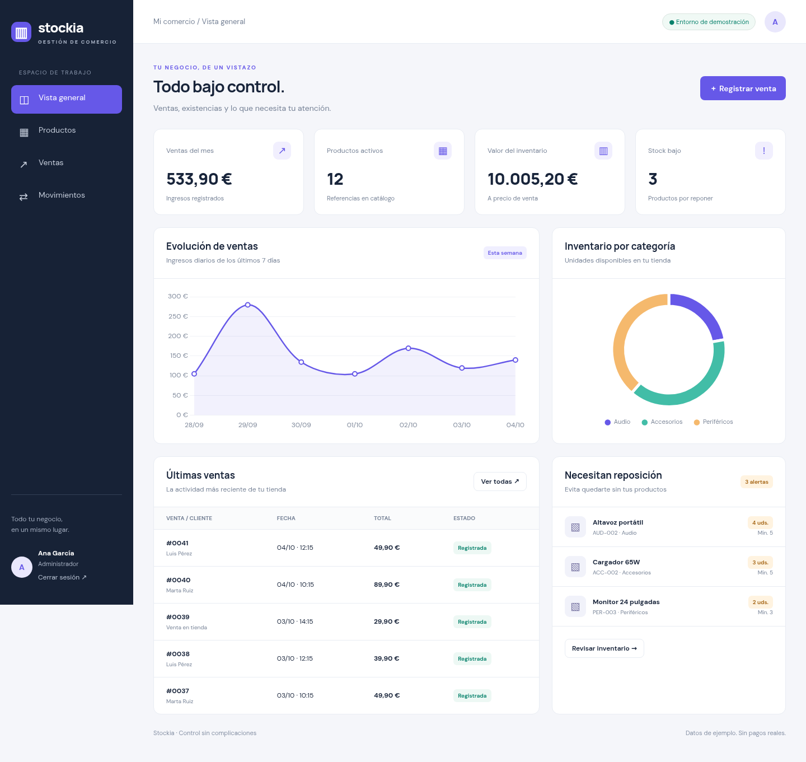
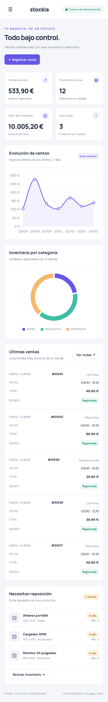

# Stockia

Panel de inventario y ventas para pequeños comercios, construido con Laravel 13 y PHP 8.4. No es un sistema de reservas: gestiona referencias, existencias y ventas de una tienda.



## Qué puedes probar

- Dashboard con ingresos del mes, referencias activas, valor de inventario y alertas de reposición.
- Gráficas de ingresos diarios y unidades por categoría con Chart.js servido desde la propia aplicación.
- Catálogo con búsqueda por nombre/SKU, filtro de categoría y filtro de stock bajo.
- Alta de categorías y productos, precio en céntimos y SKU único.
- Ventas con varias líneas: el servidor calcula el importe y descuenta existencias en una transacción. Una línea sin stock cancela la operación completa.
- Registro de entradas, ajustes y salidas, con usuario y motivo. Nunca permite existencias negativas.
- Administrador: catálogo, movimientos y ventas. Empleado: consulta y registro de ventas, sin modificar catálogo ni ajustar existencias.
- Menú desplegable y fichas de datos en móvil, sin columnas cortadas ni scroll horizontal de página.

## Demo

[Abrir demo de Stockia](https://panel-citas-v9zx.onrender.com/) · [Repositorio](https://github.com/JoseBenitezAlba/stockia)

El servicio ya se llama Stockia; conserva la URL original de Render para no romper enlaces. La primera carga del plan gratuito puede tardar alrededor de un minuto.

| Perfil | Correo | Contraseña |
| --- | --- | --- |
| Administrador | `admin@example.com` | `password` |
| Empleado | `empleado@example.com` | `password` |

Al entrar hay 12 productos, 3 categorías, ventas de los últimos 14 días y movimientos coherentes con las existencias. El seeder no duplica ventas ni restablece stock en cada arranque.

Estas credenciales son exclusivamente de demostración. Las ventas son registros internos, no cobran dinero ni emiten facturas fiscales. No introduzcas datos personales reales en una demo pública.

## Ejecución local

Requisitos: PHP 8.4 con SQLite/PDO y Composer. Esta interfaz se sirve directamente desde `public/`, sin necesitar compilar assets.

```bash
composer install
cp .env.example .env
php artisan key:generate
touch database/database.sqlite
php artisan migrate --seed
php artisan serve
```

La base de datos local usa SQLite. Para cargar datos de ejemplo en otra base de datos vacía: `php artisan db:seed`.

## Pruebas

```bash
php artisan test
vendor/bin/pint --test
```

La suite comprueba autenticación, permisos, render de las cuatro pantallas, filtros, estado vacío, precios del servidor, SKU único, venta con falta de stock y rollback, ajustes negativos y seeder idempotente. Las comprobaciones visuales se hicieron en Chrome con ventanas de 1440 px y 390 px, incluido el menú móvil, una venta con dos productos y un error de ajuste de stock.

<details>
<summary>Vista móvil</summary>



</details>

## Arquitectura y límites

`Product` pertenece a `Category`; `Sale` guarda líneas con el precio de venta de ese momento. Cada cambio de existencias añade un `StockMovement`. Las rutas de administración están protegidas en servidor, no solo escondidas en la interfaz.

- Importes almacenados como enteros en céntimos para evitar sumar floats.
- Descuento de stock condicional dentro de una transacción para evitar vender existencias que ya no están disponibles.
- Las migraciones históricas se conservan para permitir actualizar una instalación existente sin reescribir su historial. Las tablas antiguas no se usan ni exponen en la aplicación.
- Demo pública y compartida: las cuentas no son un sistema de tiendas aisladas. Para un uso real hay que desactivar el registro público, cambiar credenciales, definir permisos de acceso y añadir copias de seguridad.
- Render gratuito con SQLite en disco efímero: las modificaciones pueden perderse en un reinicio o redespliegue. Para producción, usar base de datos persistente, servidor web de producción y claves configuradas.
- No incluye pagos, facturación fiscal, devoluciones, edición de productos ni integración con proveedores. Son próximos pasos, no funciones simuladas.

## Licencia

MIT. Chart.js conserva su licencia en `public/js/CHARTJS-LICENSE.md`.
